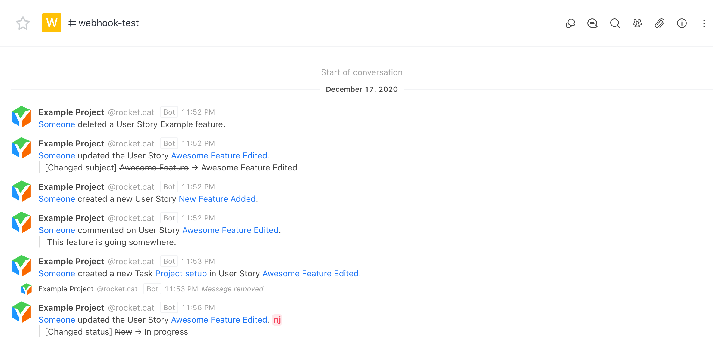
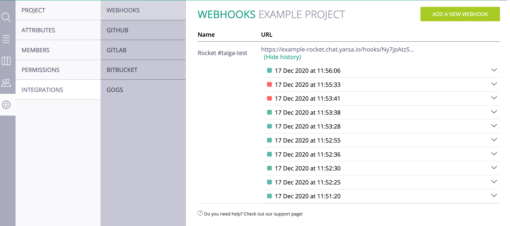

# taiga-rocketchat-webhook

 Integration between Taiga and Rocket.Chat: send Taiga activity notifications to Rocket.Chat channels.
 Inspired from [ GezimSejdiu/Rocket.Chat-Trello-Integration](https://github.com/GezimSejdiu/Rocket.Chat-Trello-Integration)
 
 
 
 ## About
 This script actually receives JSON as incoming webhook from Taiga, and creates a new JSON object by parsing and formatting it. The author is not a full-time Javascript developer, so feel free to send PR.
 
 
 
 
## Steps
-  **Create an incoming webhook in your RocketChat**
   - On your Rocket.Chat app, go to **Menu -> Administration-> Integrations-> New Integration-> Incoming webhook**
   - Remember to Set **"Enabled"** to **"True"**. Most people forget it.
   - Give a name for the webhook (i.e "My taiga->rocket hook")
   - Select the channel where you will receive the alerts (e.g: #taiga-updates) or a username (e.g: @you)
   - Select an account from which the alerts will be posted (usually rocket.cat account is used).
   - Set **"Script Enabled"** to **"True"**
   - Paste the contents of [Script.js] inside the Script field. Better use Rocket.Chat desktop app instead of the web browser.
   - Save the integration. This will generate a webhook URL and secret for you.
   - Use the generated **WebHook URL** & **Token** to POST messages to Rocket.Chat
   
- **Add webhook to your Taiga project**
   - On your Taiga project, go to **Settings -> Integrations -> Webhooks**
   - Click on the **Add a new webhook** button.
   - Give a name for the webhook (i.e "To #taiga-updates").
   - Copy the **Webhook URL** from Rocket.Chat to **Payload URL** field.
   - Copy the **Token** from Rocket.Chat to **Secret Token** field.
   - Save the webhook by clicking on the **Save** icon/button.
   - Test the integration by clicking on the **Test Webhook** icon/button.
   
-- **Test your integration**
To see what Taiga sent, click on **Show History** in Taiga webhooks settings page. It shows you the request, and response from Rocket.Chat. You should see `{"content": "{\"success\":true}"}` message if the webhook was successfully received by Rocket.Chat.

  
 
 ## References
-  [Taiga Webhook Documentation](https://taigaio.github.io/taiga-doc/dist/webhooks.html)
-  [Rocket.Chat Webhook Integration Documentation](https://docs.rocket.chat/guides/administrator-guides/integrations)
 

Also see the logs on Rocket.Chat: **Administration -> View Logs**. 

### Contributing
The is a work in progress; it does not currently support for many features, including Epics, which are trivial to add.

### License
MIT

 
